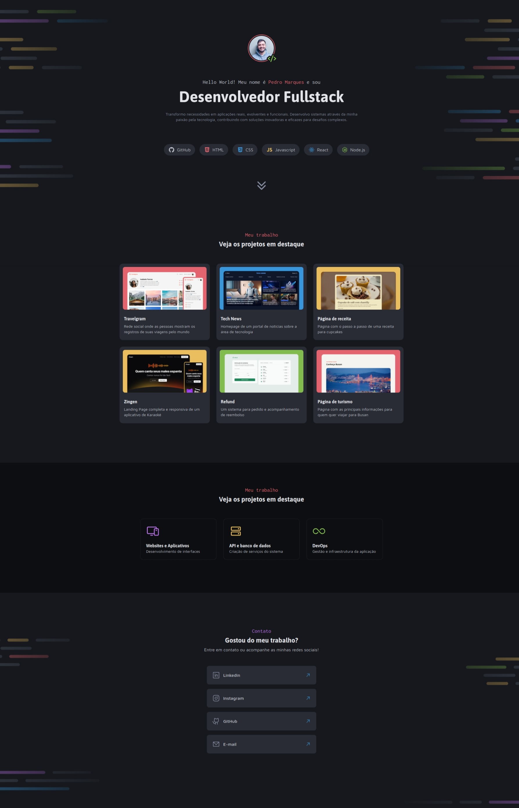

# 🧑‍💻 PROJETO PORTFÓLIO DEV

Este repositório contém uma página desenvolvida com **HTML** e **CSS**, nela contém um portfólio próprio. O projeto tem fins educacionais e foi criado para praticar o Flexbox e Grid do CSS.

## 📸 Prévia

 <!-- Substitua pelo caminho correto da imagem se houver -->

## 🚀 Funcionalidades

- Estrutura semântica utilizando tags HTML5.
- Estilização com CSS puro.

## 📂 Estrutura de Arquivos
- assets/
- styles/
- index.html

## 🛠️ Tecnologias Utilizadas

- HTML5
- CSS3

## 🧠 Conceitos Aplicados

- Flexbox
- Grid
- Seletores
- Combinators
- Valores e Unidades de Medidas
- Especificidade do CSS

### Desenvolvido com 💖, utilizando o curso Fullstack da [Rocketseat](https://www.rocketseat.com.br/) para fins de aprendizado.